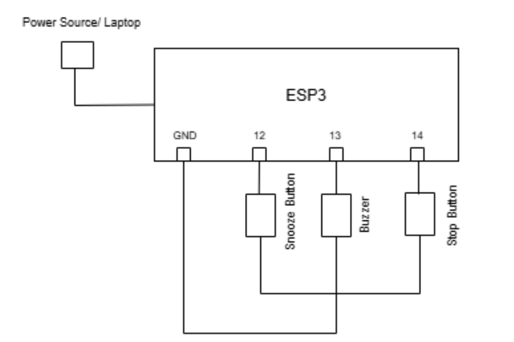

# Smart-Alarm-Clock (ESP32 + Google Calendar)

A DIY smart alarm clock built on an ESP32.  
Features:
- NTP-synced time  
- Web UI to set alarms  
- Two physical buttons: Snooze & Stop  
- Buzzer alarm  
- On Stop → fetch today’s Google Calendar events via a Flask API


## 📂 Repository Structure

```text
smart-alarm-clock/
├── arduino/
│ ├── SmartAlarm.ino ← ESP32 sketch
│ └── libraries.txt ← list of Arduino libraries to install
├── flask-server/
│ ├── app.py ← Flask API server
│ └── requirements.txt ← Python dependencies
├── docs/
│ └── circuit-diagram.png ← wiring diagram
├── .gitignore
└── README.md
```

## ⚙️ Setup Instructions

### 1. Arduino ESP32 Sketch

1. Open **Arduino IDE**.  
2. Install libraries (Sketch → Include Library → Manage Libraries …):  
   - ESPAsyncWebServer  
   - AsyncTCP  
   - ArduinoJson  
   - ESPmDNS
> These libraries are already mentioned in smart-alarm-clock/arduino/libraries.txt   
3. Copy `arduino/SmartAlarm.ino` into your sketch folder.  
4. Edit **Wi-Fi Name**, **Wi-Fi Password**, and **serverUrl** as needed.  
5. Compile & upload to your ESP32.

### 2. Flask API Server

1. Run these commands - 
```bash
cd flask-server
python3 -m venv venv
source venv/bin/activate
pip install -r requirements.txt
```
2. Copy your own OAuth2 client_secret JSON to credentials.json
3. Then run this final command to run the flask server - 
```bash
python app.py
```
4. Visit http://localhost:5000/ → health check.
5. Visit http://localhost:5000/events → today’s events JSON.

## ⚡ Wiring Diagram



Buzzer → GPIO 13 & GND

Snooze Button → GPIO 12 & GND (INPUT_PULLUP)

Stop Button → GPIO 14 & GND (INPUT_PULLUP)

5 V (or 3.3 V) power to buzzers from ESP32 VIN.

## 🎉 Usage

Power up ESP32; it will host a web server on port 80.

Browse to http://<ESP32_IP>/ to set your alarm.

When alarm rings:

Press Snooze → buzzer off, rings again after 2 min.

Press Stop → buzzer off & calendar events appear on the page.
> NOTE - It is better to visit the `http://localhost:5000/events` at first, as Google Calendar requires OAuth and running this in browser first will let you sign in and then get the access key for running the project smoothly later on
Enjoy your new Smart Alarm Clock!
